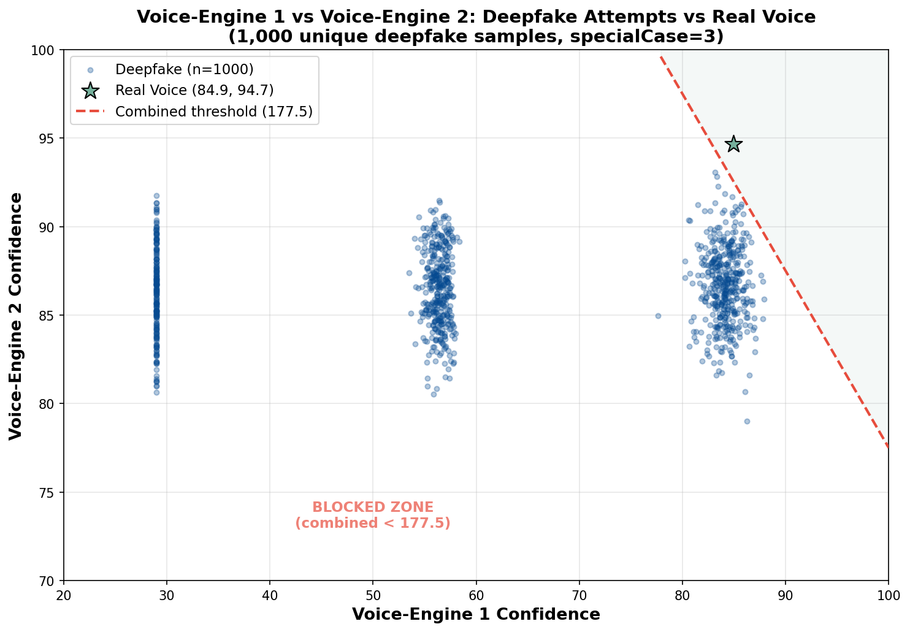
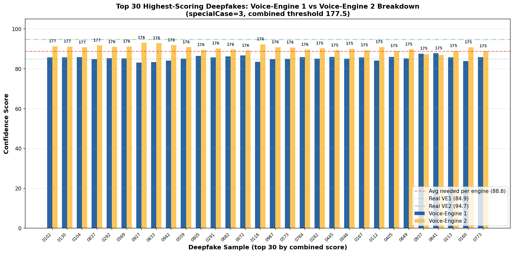
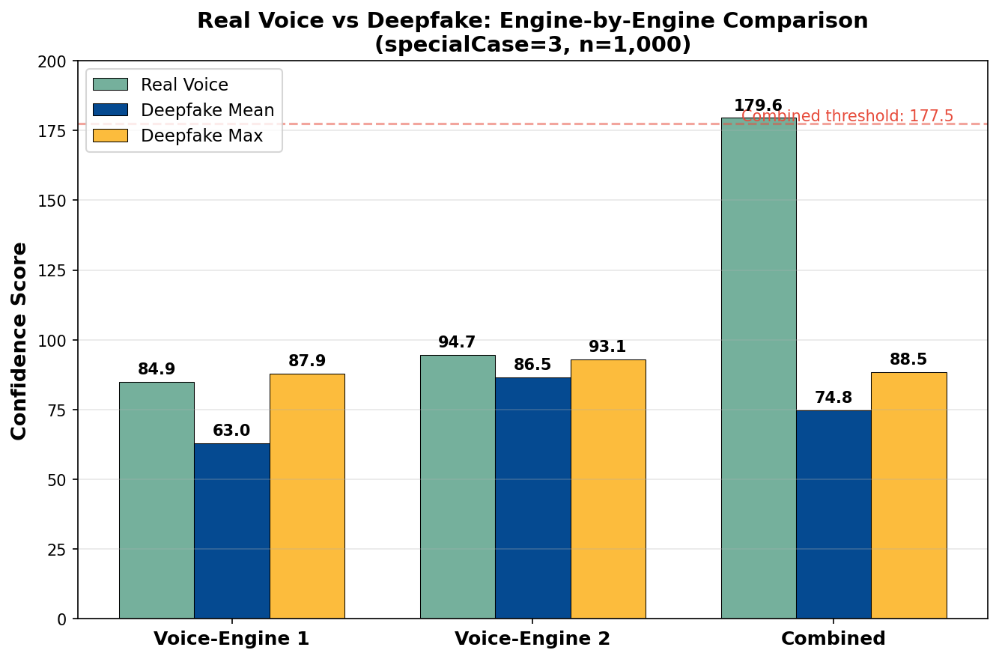
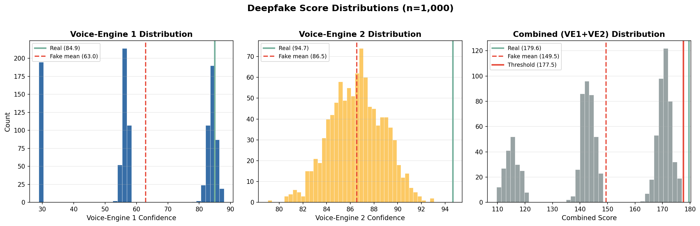

# DeepFakeVsSecurityAssets

[](https://voiceit.io)
[](https://voiceit.io/blog/deepFakesVsSecurity)
[](https://github.com/voiceittech/DeepFakeVsSecurityAssets/blob/main/LICENSE)

Audio assets, test scripts, and results for **"The Voice Impersonation Showdown: Deepfakes Meet Their Match in VoiceIt API 3.0 Biometric Voice Verification"**.

Published at: [voiceit.io/blog/deepFakesVsSecurity](https://voiceit.io/blog/deepFakesVsSecurity)

## Overview

1,000 deepfake voice clones of Voice A were generated using [ElevenLabs](https://elevenlabs.io/) Professional Voice Cloning (VPP), trained on over 30 minutes of real voice samples. This represents a high-fidelity attack scenario — a well-funded adversary with substantial source material using a leading commercial voice cloning platform.

## Results (1,000 Verification Attempts)

Each of the 1,000 unique deepfake samples was tested once against the enrolled real voice, using the combined dual-engine threshold (specialCase=3, combined threshold 177.5).

### Overall

| Metric | Value |
|--------|-------|
| Deepfake rejection rate | **100%** (1,000/1,000 blocked) |
| Real voice acceptance | **100%** (combined 179.57) |
| Combined threshold | **177.5** (voice-engine 1 + voice-engine 2) |
| Real voice margin | **+2.07** above threshold |
| Best deepfake combined | **176.98** (0.52 below threshold) |
| Deepfake combined mean | 149.49 |
| Text confidence (deepfake mean) | 97.27 |

### Engine Breakdown

| Engine | Real Voice | Deepfake Mean | Deepfake Max | Deepfake Min |
|--------|-----------|---------------|--------------|--------------|
| Voice-Engine 1 | 84.91 | 62.95 | 87.90 | 28.91 |
| Voice-Engine 2 | 94.66 | 86.54 | 93.07 | 79.02 |
| Combined | 179.57 | 149.49 | 176.98 | 109.65 |

Voice-engine 1 does the heavy lifting against deepfakes — deepfake voice-engine 1 scores average 21.96 points below the real voice. Deepfakes score high on voice-engine 2 (mean 86.54, close to real 94.66) because they sound like the target speaker to neural embeddings. But voice-engine 1's vocal tract analysis catches the synthesis artifacts, and the combined threshold ensures neither engine alone can pass a fake.

### Graphs

**Voice-Engine 1 vs Voice-Engine 2 Scatter: Deepfake Attempts vs Real Voice**



**Top 30 Highest-Scoring Deepfakes: Voice-Engine 1 vs Voice-Engine 2 Breakdown**



**Real vs Deepfake: Engine-by-Engine Comparison**



**Deepfake Score Distributions (Voice-Engine 1, Voice-Engine 2, Combined)**



## Repository Structure

```
.
├── real_samples/                  # 4 genuine voice recordings (WAV, 16-bit)
│   ├── VoiceA_1_Real.wav          # Enrollment sample 1
│   ├── VoiceA_2_Real.wav          # Enrollment sample 2
│   ├── VoiceA_3_Real.wav          # Enrollment sample 3
│   └── VoiceA_4_Real.wav          # Verification control sample
├── deepfake_samples/              # 1,000 ElevenLabs VPP deepfake clones (MP3)
│   ├── VoiceA_VPP_0031.mp3
│   ├── ...
│   └── VoiceA_VPP_1030.mp3
├── VoiceA_Preview.mp3             # ElevenLabs voice clone preview
├── deepfake_spoof_test.py         # Automated spoof test script (supports --count N)
├── spoof_test_results.json        # Latest test run results (1,000 attempts)
├── graph_siv1_vs_siv2_scatter.png # Voice-engine 1 vs 2 scatter with combined threshold
├── graph_siv1_siv2_per_sample.png # Top 30 deepfakes: per-engine breakdown
├── graph_engine_comparison.png    # Real vs deepfake engine comparison
└── graph_distribution.png         # Voice-engine 1, 2, and combined distributions
```

## How It Works

### Test Flow (`deepfake_spoof_test.py`)

1. Creates a temporary user via the API
2. Enrolls with 3 real voice samples (VoiceA_1-3_Real.wav)
3. Verifies with the 4th real sample as a control
4. Attempts verification with each of the 1,000 deepfake VPP samples
5. Reports pass/fail for each attempt with voice-engine 1, voice-engine 2, and combined confidence scores
6. Cleans up (deletes user)

### Dual Engine Architecture

VoiceIt API 3.0 uses two independent voice biometric engines with a combined threshold (specialCase=3):

- **Voice-Engine 1** - Analyzes Linear Prediction Coefficients (physiological vocal tract characteristics). Tunable parameters: frame length, LP degrees, accuracy, confidence threshold, noise removal
- **Voice-Engine 2** - Analyzes neural speaker embeddings (192-dimensional voice representation). Tunable parameter: confidence threshold

Verification passes only when voice-engine 1 + voice-engine 2 combined score exceeds the combined threshold (177.5). This prevents deepfakes from passing by fooling just one engine. Across 1,000 deepfake verification attempts, the best combined score was 176.98 (0.52 below threshold) while the real voice scored 179.57 (2.07 above).

## Running the Tests

### Prerequisites

- Python 3 with `requests`
- VoiceIt API 3.0 credentials set as environment variables

### Environment Variables

| Variable | Description |
|----------|-------------|
| `SPOOF_API_KEY` | VoiceIt API key for the spoof test developer account |
| `SPOOF_API_TOKEN` | VoiceIt API token for the spoof test developer account |
| `API_BASE_URL` | API base URL (defaults to `https://api.voiceit.io`) |

These are stored as GitHub repository secrets (`SPOOF_API_KEY`, `SPOOF_API_TOKEN`) for CI use.

### Spoof Test

```bash
export SPOOF_API_KEY="key_..."
export SPOOF_API_TOKEN="tok_..."

# Run with all 1,000 samples (one attempt each)
python3 deepfake_spoof_test.py

# Run a specific number of attempts
python3 deepfake_spoof_test.py --count 500
```

Saves results to `spoof_test_results.json` with per-attempt data, per-sample aggregation, and descriptive statistics.

## Related

- [voiceit3-api](https://github.com/voiceittech/voiceit3-api) - VoiceIt API 3.0 (dual voice-engine implementation)
- [voiceit3-website](https://github.com/voiceittech/voiceit3-website) - VoiceIt website with live demo
- [voiceit3-testingscripts](https://github.com/voiceittech/voiceit3-testingscripts) - API test suite (390 tests)
- [VoiceIt API 3.0 Documentation](https://voiceit.io/documentation)
